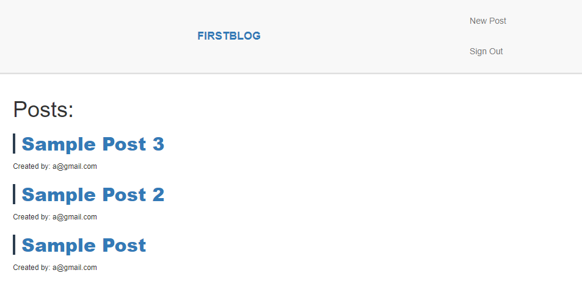
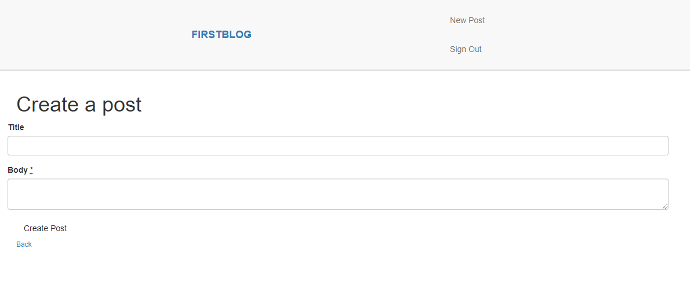
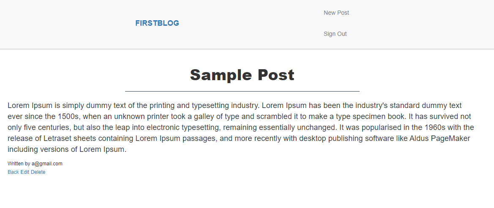

# Blog Implemented with Ruby on Rails

This is a blog application I created with Ruby on Rails. It has user authentication implemented with the devise rubygem.

The blog looks as follows:

One can easily create a new post, or edit or delete an existing post provided they own it. Note that creating a post requires a user to be logged in. The screen for the creation process looks as folows:

Users can also view anyone's post. Note that in this screenshot the user is also the post creator so they have options to edit or delete the post. These are not available if the user is not the post creator.

`code`

$\lambda=20$
$$l=2$$
$l=2$
